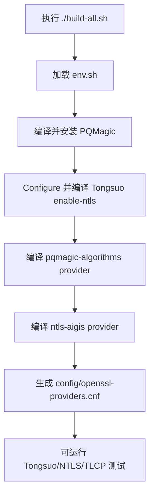

# 编译 tlcpMonoRepo

本文档说明如何编译 `tlcpMonoRepo` 的核心组件，包括 PQMagic、启用 NTLS/TLCP 的 Tongsuo，以及本项目使用的 OpenSSL provider。

## 1. 编译范围

顶层 `build-all.sh` 负责构建以下内容：

| 组件 | 路径 | 作用 |
|---|---|---|
| PQMagic | `pqmagic/` | PQC 算法库 |
| Tongsuo | `tongsuo/` | 带 NTLS/TLCP 能力的 OpenSSL 兼容协议库 |
| pqmagic provider | `providers/pqmagic-algorithms/` | 注册 PQMagic 相关算法 |
| ntls-aigis provider | `providers/ntls-aigis/` | NTLS/TLCP 测试栈使用的 provider |
| provider 配置 | `config/openssl-providers.cnf` | 由模板生成的运行时 provider 配置 |


## 2. 推荐环境


```bash
cd /root
git clone https://github.com/haabbcc/tlcpMonoRepo-work.git
cd tlcpMonoRepo-work
```

Ubuntu 依赖安装：

```bash
sudo apt update
sudo apt install -y build-essential cmake perl git
```

## 3. 编译命令

在仓库根目录执行：

```bash
cd /root/tlcpMonoRepo-work
./build-all.sh
source ./env.sh
```

可以通过环境变量调整构建：

| 变量 | 默认值 | 说明 |
|---|---|---|
| `JOBS` | `nproc` 或 `4` | 并行编译任务数 |
| `TONGSUO_CONFIGURE` | `linux-x86_64 enable-ntls enable-shared` | Tongsuo Configure 参数 |
| `TLCP_ROOT` | 来自 `env.sh` | 仓库根目录 |
| `TONGSUO_ROOT` | `${TLCP_ROOT}/tongsuo` | Tongsuo 源码目录 |
| `PQMAGIC_PREFIX` | 来自 `env.sh` | PQMagic 安装目录 |

示例：

```bash
JOBS=8 ./build-all.sh
source ./env.sh
```

## 4. 构建流程



## 5. 编译后验证

执行：

```bash
source ./env.sh
${OPENSSL} version -a
${OPENSSL} list -providers
```

期望至少能看到：

```text
default
pqmagic
aigis_enc
```

如果 provider 加载失败，检查：

```bash
echo "$OPENSSL"
echo "$OPENSSL_CONF"
test -f "$OPENSSL_CONF" && cat "$OPENSSL_CONF"
```
```

说明当前仓库检出不完整，`tongsuo/test/` 下的源码没有完整下载或没有正确提交到远程仓库。应重新克隆仓库，或检查 GitHub 远端是否包含完整的 `tongsuo/test` 目录。

不要通过删除 Tongsuo 构建元数据中的测试项来规避该问题，那会掩盖源码树不完整的问题。
