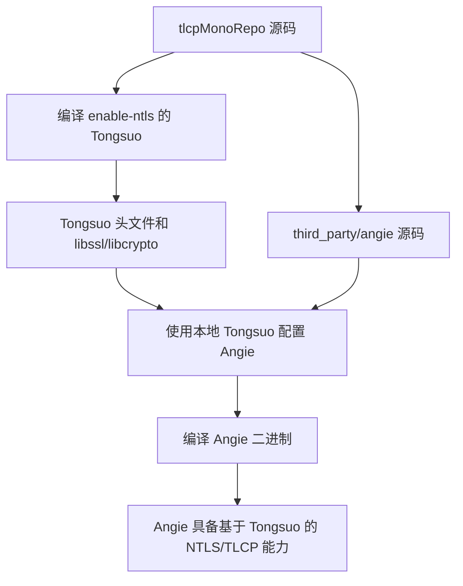

# 编译 Angie

本文档说明如何使用本仓库中的 Tongsuo 编译 Angie。

## 1. 范围

Angie 源码位于：

```text
third_party/angie/
```

Angie 构建脚本位于：

```text
scripts/Angie_TLCP_PQC/
```

本文只说明 Angie 如何编译。Angie 如何和 `tlcpMonoRepo` 联调见 `04_ANGIE_TLCP_MONOREPO_INTEGRATION.md`。

## 2. 前置条件

先编译核心项目：

```bash
cd /root/tlcpMonoRepo-work
./build-all.sh
source ./env.sh
```

Ubuntu 下安装 Angie/Nginx 常见构建依赖：

```bash
sudo apt update
sudo apt install -y build-essential libpcre3-dev zlib1g-dev
```

根据 Angie 配置，可能还需要：

```bash
sudo apt install -y libxslt1-dev libgd-dev libgeoip-dev
```

## 3. 编译命令

只编译 Angie：

```bash
cd /root/tlcpMonoRepo-work
bash scripts/Angie_TLCP_PQC/build-angie.sh
```

或者执行 Angie 联调栈构建脚本：

```bash
bash scripts/Angie_TLCP_PQC/build-stack.sh
```

脚本依赖以下环境变量：

| 变量 | 说明 |
|---|---|
| `TLCP_ROOT` | 仓库根目录 |
| `TONGSUO_ROOT` | 本地 Tongsuo 源码和构建目录 |
| `OPENSSL` | `env.sh` 中配置的 Tongsuo `openssl` 命令 |
| `OPENSSL_CONF` | 生成后的 provider 配置文件 |

## 4. 编译关系



## 5. 检查编译结果

编译后检查 Angie 二进制是否生成在脚本配置的输出目录中。通常构建和安装产物应位于被忽略的目录中，不应提交到仓库。

可用检查命令：

```bash
find /root/tlcpMonoRepo-work -path '*angie*' -type f -name angie -o -name nginx
```

如果 configure 阶段失败，检查：

```bash
source /root/tlcpMonoRepo-work/env.sh
echo "$TONGSUO_ROOT"
test -d "$TONGSUO_ROOT"
test -f "$TONGSUO_ROOT/libssl.a" -o -f "$TONGSUO_ROOT/libssl.so"
```

## 6. 提交范围

应提交：

```text
third_party/angie/
```

不应提交：

- Angie 构建产物
- object 文件
- 临时安装目录
- Angie 内部 `.git` 目录
