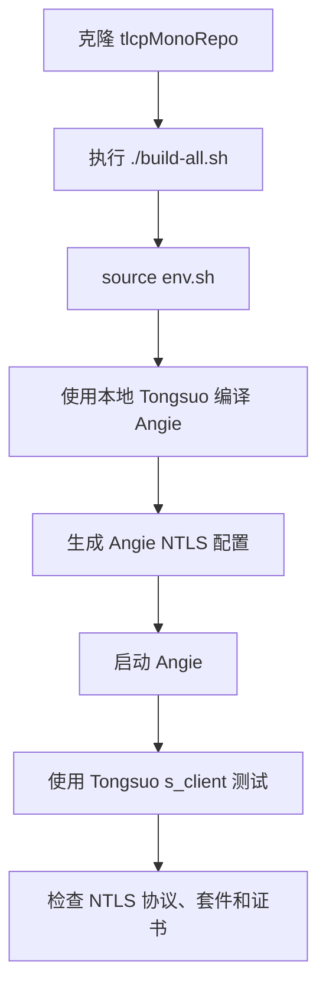

# Angie 与 tlcpMonoRepo 联调

本文档说明 Angie 如何使用 `tlcpMonoRepo` 中构建出的 Tongsuo、TLCP/NTLS、PQC/GM provider 和证书进行联调。

## 1. 联调目标

目标组合如下：

```text
Angie 服务端
  + 本地 Tongsuo libssl/libcrypto
  + 启用 NTLS/TLCP
  + 国密/PQC 双证书配置
  + Tongsuo s_client 或 demo client 作为测试客户端
```

该组合用于验证 Angie 可以作为 NTLS/TLCP 服务端，并使用本仓库构建出的协议库和 provider 栈完成握手。

## 2. 推荐顺序



命令示例：

```bash
cd /root/tlcpMonoRepo-work
./build-all.sh
source ./env.sh
bash scripts/Angie_TLCP_PQC/build-stack.sh
bash scripts/Angie_TLCP_PQC/render-conf.sh
```

## 3. 运行脚本

| 脚本 | 作用 |
|---|---|
| `scripts/Angie_TLCP_PQC/build-stack.sh` | 构建 Angie + Tongsuo 联调栈 |
| `scripts/Angie_TLCP_PQC/build-angie.sh` | 只编译 Angie |
| `scripts/Angie_TLCP_PQC/render-conf.sh` | 生成 Angie 运行配置 |
| `scripts/Angie_TLCP_PQC/start-angie.sh` | 启动 Angie |
| `scripts/Angie_TLCP_PQC/stop-angie.sh` | 停止 Angie |
| `scripts/Angie_TLCP_PQC/test-client.sh` | 执行客户端 NTLS 测试 |

## 4. 证书模型

Angie 的 NTLS 联调使用 Tongsuo 国密双证书模型：

| 证书角色 | 作用 |
|---|---|
| 签名证书 | 用于身份认证 |
| 加密证书 | 用于 NTLS/TLCP 密钥交换或加密路径 |
| CA 证书 | 用于验证对端证书链 |

这与普通 TLS 的单证书模型不同。普通 TLS 通常每个端点只加载一组证书和私钥。

## 5. 启动与测试

启动 Angie：

```bash
cd /root/tlcpMonoRepo-work
bash scripts/Angie_TLCP_PQC/start-angie.sh
```

运行客户端测试：

```bash
bash scripts/Angie_TLCP_PQC/test-client.sh
```

停止 Angie：

```bash
bash scripts/Angie_TLCP_PQC/stop-angie.sh
```

## 6. 期望验证点

联调时应关注：

| 检查项 | 期望 |
|---|---|
| 协议版本 | NTLS/TLCP，Tongsuo 常显示为 `NTLSv1.1` |
| 密码套件 | `ECC-KYBER-SM4-GCM-SM3` 或 `ECDHE-KYBER-SM4-GCM-SM3` |
| 服务端证书 | Angie 提供签名证书和加密证书 |
| 客户端结果 | Tongsuo client 完成握手 |
| 数据通路 | HTTP 请求响应或 demo 数据可以通过加密通道完成 |

## 7. 为什么使用 Tongsuo s_client 测试 Angie

Angie 是面向服务端的 Nginx 兼容应用，不适合作为通用 TLS/NTLS 客户端做点对点协议验证。

Tongsuo `s_client` 更适合作为验证客户端，因为它能直接显示协议版本、密码套件、证书信息和握手错误。

如果要验证反向代理、上游连接或双 Angie 架构，可以使用两个 Angie 实例；但这不是验证 NTLS/TLCP 协议栈最直接的方式。
