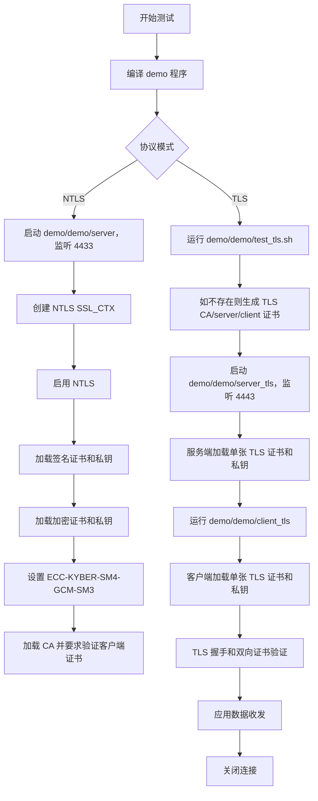
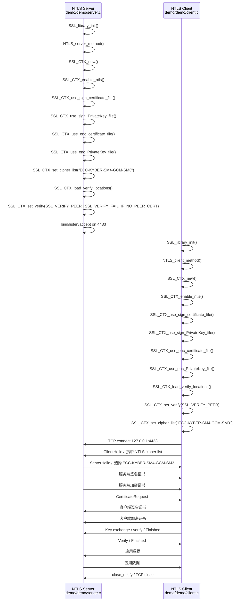
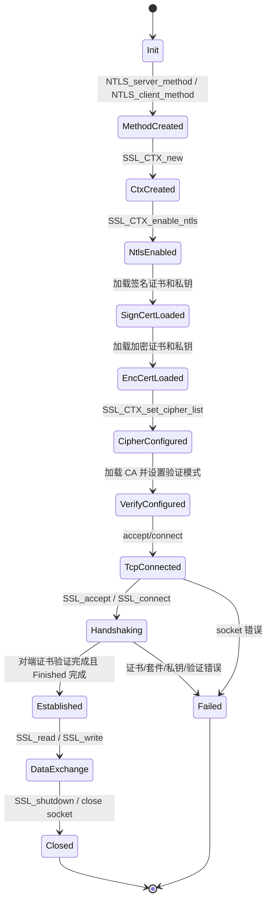
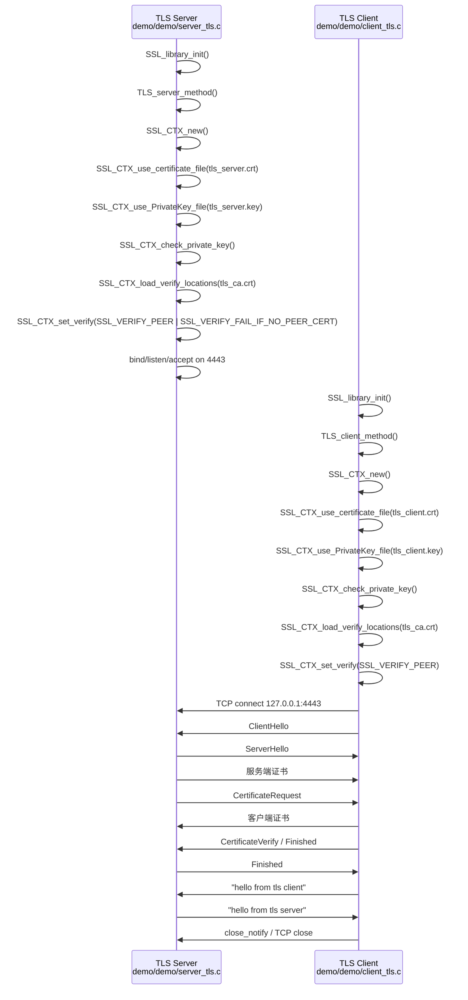
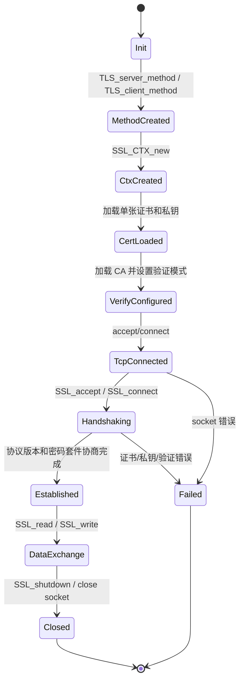

# NTLS 与 TLS 通信测试流程和状态机

本文档用 Mermaid 流程图和状态机说明当前 `demo/demo` 中 NTLS 与 TLS 两组 server/client 的通信测试过程。

## 1. 测试入口流程

## 2. NTLS 双证书握手时序

NTLS demo 使用 Tongsuo 的 NTLS/TLCP 接口。server 和 client 都加载两组证书和私钥：一组用于签名身份认证，一组用于加密或密钥交换路径。

## 3. NTLS 状态机

## 4. 普通 TLS 双向认证握手时序

TLS demo 使用 `server_tls.c` 和 `client_tls.c`。这一路径不调用 `SSL_CTX_enable_ntls()`，只使用普通 TLS 方法和单证书接口。

## 5. TLS 状态机

