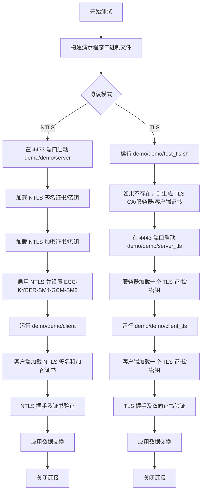
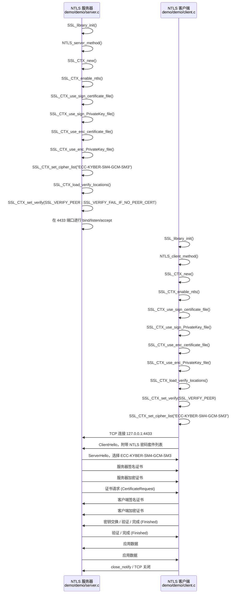
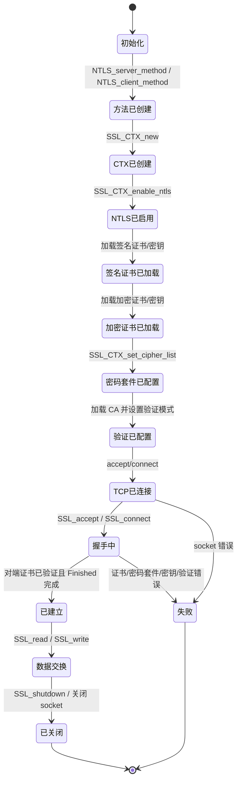
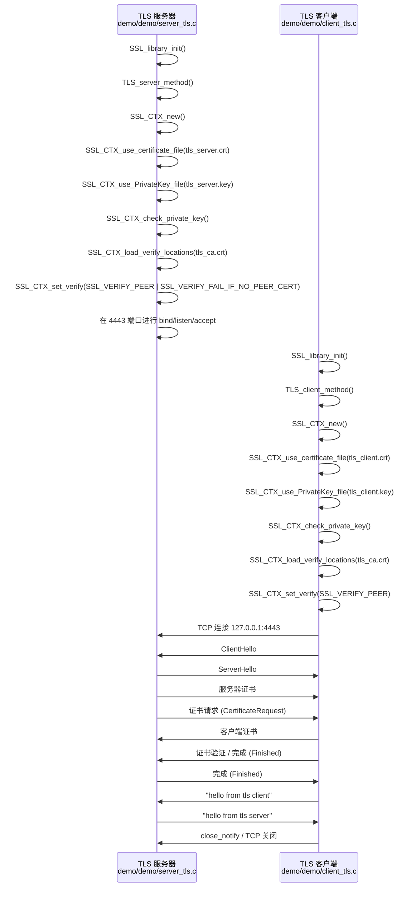
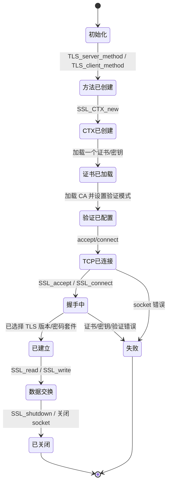

好的，这是您提供的 Markdown 文档的汉化版本。

---

# title: NTLS 与 TLS 通信状态机
content:

本文档通过使用 Mermaid 流程图和状态机，展示了 NTLS 和 TLS 演示程序的服务器/客户端通信测试。

# title: NTLS 与 TLS 通信状态机  1. 测试入口流程
content:

# title: NTLS 与 TLS 通信状态机  2. NTLS 双证书握手
content:

NTLS 演示程序使用铜锁 NTLS/TLCP 接口。服务器和客户端都加载两个证书/密钥对：一个用于签名，一个用于加密。

# title: NTLS 与 TLS 通信状态机  2. NTLS 双证书握手  NTLS 状态机
content:

# title: NTLS 与 TLS 通信状态机  3. 标准 TLS 双向认证握手
content:

TLS 演示程序使用 `server_tls.c` 和 `client_tls.c`。此路径不调用 `SSL_CTX_enable_ntls()`。它使用标准的 TLS 方法和单证书 API。

# title: NTLS 与 TLS 通信状态机  3. 标准 TLS 双向认证握手  TLS 状态机
content:

# title: NTLS 与 TLS 通信状态机  4. 通信路径中的接口差异
content:

| 项目 | NTLS 演示程序 | TLS 演示程序 |
|---|---|---|
| 服务器源码 | `demo/demo/server.c` | `demo/demo/server_tls.c` |
| 客户端源码 | `demo/demo/client.c` | `demo/demo/client_tls.c` |
| 方法接口 | `NTLS_server_method()`, `NTLS_client_method()` | `TLS_server_method()`, `TLS_client_method()` |
| NTLS 开关 | `SSL_CTX_enable_ntls()` | 未使用 |
| 服务器证书模型 | 签名证书 + 加密证书 | 一个 TLS 证书 |
| 客户端证书模型 | 签名证书 + 加密证书 | 一个 TLS 证书 |
| 证书加载接口 | `SSL_CTX_use_sign_certificate_file()`, `SSL_CTX_use_sign_PrivateKey_file()`, `SSL_CTX_use_enc_certificate_file()`, `SSL_CTX_use_enc_PrivateKey_file()` | `SSL_CTX_use_certificate_file()`, `SSL_CTX_use_PrivateKey_file()` |
| 验证 | 通过 `SSL_CTX_load_verify_locations()` 加载 CA；启用对端证书验证 | 通过 `SSL_CTX_load_verify_locations()` 加载 CA；启用对端证书验证 |
| 密码套件配置 | `ECC-KYBER-SM4-GCM-SM3` | 默认 TLS 密码套件协商 |
| 测试端口 | `4433` | `4443` |
| 验证结果 | 已为 NTLS 双证书 PQC/GM 握手配置 | 已使用 TLSv1.3 和双向证书认证进行测试 |

# title: NTLS 与 TLS 通信状态机  5. 实际解读
content:

NTLS 的关键区别不仅在于它多使用了一个证书。其状态机有两条独立的证书/密钥加载路径：一条用于签名身份，另一条用于加密或密钥交换。

标准的 TLS 测试证实，同一个协议库也可以通过非 NTLS API 路径运行。它验证了单证书路径、标准 TLS 握手和双向证书认证，但并未验证国密双证书 NTLS 状态机。
